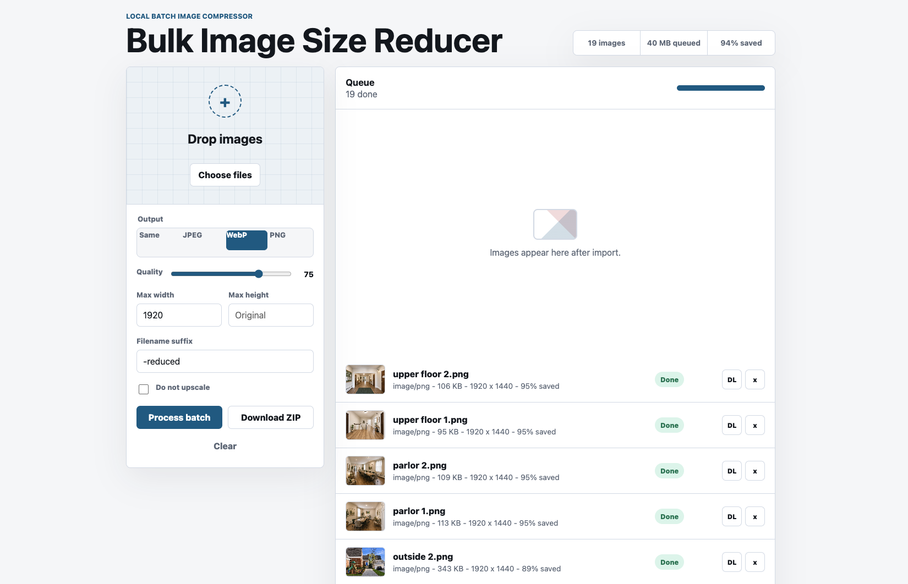

# Bulk Image Size Reducer

A fast, local-first batch image compressor for people who want the practical parts of Squoosh without feeding files through one at a time.

Drop in a whole folder of images, choose an output format, tune quality and max dimensions, then download individual results or a single ZIP.

Live app: [bulk-image-size-reducer.pages.dev](https://bulk-image-size-reducer.pages.dev)



## What It Does

- Accepts many images at once with drag-and-drop or file picker upload.
- Exports to WebP, JPEG, PNG, or the original supported format.
- Compresses with a quality slider for JPEG and WebP.
- Resizes by max width and/or max height while preserving aspect ratio.
- Avoids accidental upscaling with the no-upscale option.
- Shows per-image status, dimensions, output size, and percent saved.
- Downloads single processed images or the whole batch as a ZIP.

## Why This Exists

Squoosh is excellent for carefully tuning one image, but its public app is not built for quick bulk work. This tool is meant for the everyday batch case: resize and reduce a set of images with consistent settings, then move on.

## Run Locally

No install step is required beyond Node.js.

```sh
npm start
```

Then open:

```text
http://127.0.0.1:4173
```

The included server only serves the static files in this folder.

## Deploy

The app is static, so it can be hosted on Cloudflare Pages, GitHub Pages, Netlify, Vercel, or any plain static host. For Cloudflare Pages, deploy the project root:

```sh
npx wrangler pages deploy . --project-name bulk-image-size-reducer
```

## Privacy

Image processing happens in your browser. Files are decoded, resized, compressed, and zipped client-side; they are not uploaded to an application server by this project.

## Limitations

- Compression uses the browser canvas encoder, so output can differ from Squoosh's full codec stack.
- Animated GIFs and animated WebP files are flattened to the first decoded frame.
- Canvas export strips most metadata by default.
- Very large batches are limited by browser memory.

## Project Structure

```text
.
|-- app.js        # Batch processing, canvas export, and ZIP creation
|-- index.html    # Static app shell
|-- server.mjs    # Tiny local static server
|-- styles.css    # Responsive interface styling
`-- docs/
    `-- screenshot.png
```
