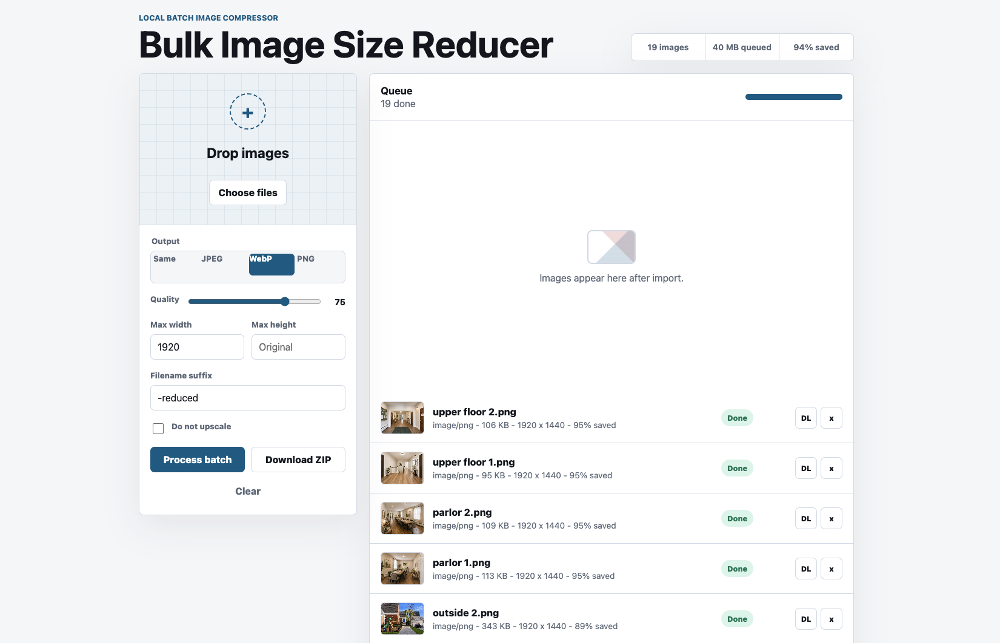
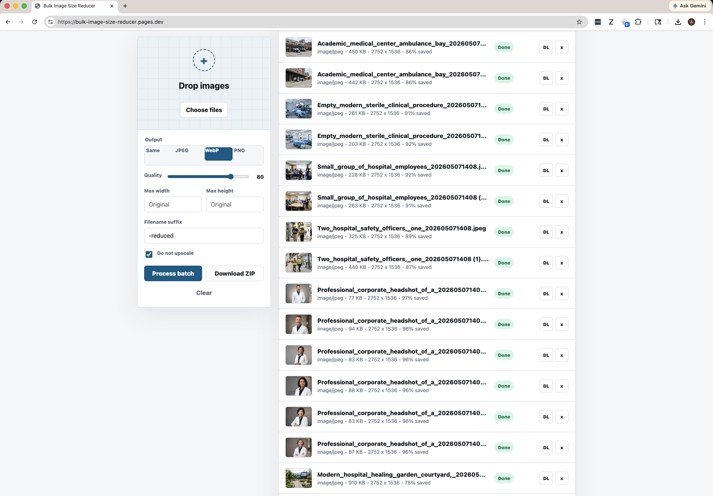
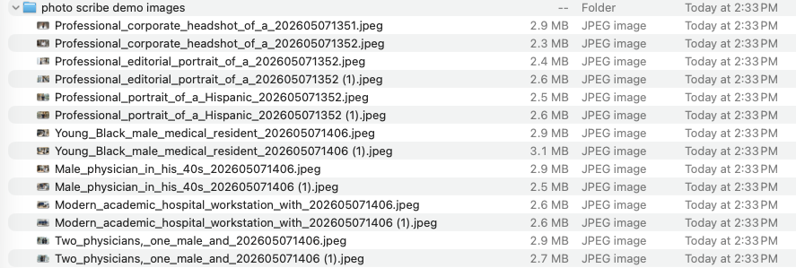
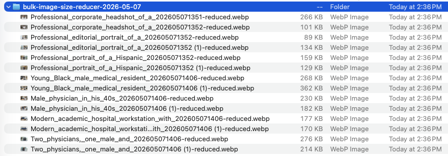

# Bulk Image Size Reducer

A fast, browser-based batch image compressor for people who want the practical parts of Squoosh without feeding files through one at a time.

Drop in a whole folder of images, choose an output format, tune quality and max dimensions, then download individual results or a single ZIP.

Live app: [bulk-image-size-reducer.pages.dev](https://bulk-image-size-reducer.pages.dev)


## About

Bulk Image Size Reducer is a static web app for reducing many images locally in the browser. It is built for practical batch cleanup: convert to WebP, JPEG, PNG, or the source format; cap dimensions without upscaling; compare per-file savings; and export a completed batch as a ZIP.

The project has no application backend and no upload pipeline. Image decode, resize, encode, preview, download, and ZIP generation all run client-side with browser APIs, which keeps the tool easy to host and keeps selected files on the user's device.

## Tech Stack

- HTML
- CSS
- JavaScript
- Browser File APIs
- Canvas API
- Blob and Object URL APIs
- Client-side ZIP generation
- Node.js static development server

## Engineering Highlights

- Runs fully client-side with no image uploads or backend processing.
- Handles batch queue state, previews, resizing, encoding, and ZIP export in vanilla JavaScript.
- Uses browser-native APIs with zero runtime dependencies.
- Includes ADRs and a C4-style architecture diagram for the main implementation decisions.

## Batch Results Example



## Real Workflow Example

This tool is useful when a site needs many images prepared for the web, not just one polished image. In this example, a folder of high-resolution JPEGs was processed as a batch and exported as WebP files with consistent settings.



Before compression, the source JPEGs were multi-megabyte files:



After batch export, the WebP versions are much smaller and ready for website use:



For image-heavy sites, this turns optimizing large batches, potentially hundreds of assets depending on browser memory, from a tedious one-at-a-time workflow into a repeatable batch process. Smaller image assets can help pages load faster and support better technical SEO by reducing unnecessary transfer size.

## What It Does

- Accepts many images at once with drag-and-drop or file picker upload.
- Exports to WebP, JPEG, PNG, or the original supported format.
- Compresses with a quality slider for JPEG and WebP.
- Resizes by max width and/or max height while preserving aspect ratio.
- Avoids accidental upscaling with the no-upscale option.
- Shows per-image status, dimensions, output size, and percent saved.
- Downloads single processed images or the whole batch as a ZIP.

## Why This Exists

Squoosh is excellent for carefully tuning one image, but its public app is not built for quick bulk work. This tool is meant for the everyday batch case: resize and reduce a set of website images with consistent settings, then move on. It avoids launching Adobe Lightroom or a heavier desktop editing workflow just to prepare web images for faster-loading pages.

## Architecture

- [Architecture overview and C4 diagram](docs/architecture.md)
- [Architecture decision records](docs/adrs/README.md)

## Run in Development

No install step is required beyond Node.js.

```sh
npm start
```

Then open:

```text
http://127.0.0.1:4173
```

The included server only serves the static files in this folder.

## Deploy

The app is static, so it can be hosted on Cloudflare Pages, GitHub Pages, Netlify, Vercel, or any plain static host. For Cloudflare Pages, deploy the project root:

```sh
npx wrangler pages deploy . --project-name bulk-image-size-reducer
```

## Privacy

Image processing happens in your browser. Files are decoded, resized, compressed, and zipped client-side; they are not uploaded to an application server by this project.

## Limitations

- Compression uses the browser canvas encoder, so output can differ from Squoosh's full codec stack.
- Animated GIFs and animated WebP files are flattened to the first decoded frame.
- Canvas export strips most metadata by default.
- Very large batches are limited by browser memory.

## Project Structure

```text
.
|-- app.js        # Batch processing, canvas export, and ZIP creation
|-- index.html    # Static app shell
|-- server.mjs    # Tiny static server for development
|-- styles.css    # Responsive interface styling
`-- docs/
    |-- architecture.md
    |-- adrs/
    |-- image-sizes-after.png
    |-- image-sizes-before.png
    |-- screenshot.png
    |-- workflow-batch-processing.png
    `-- batch-results.png
```
