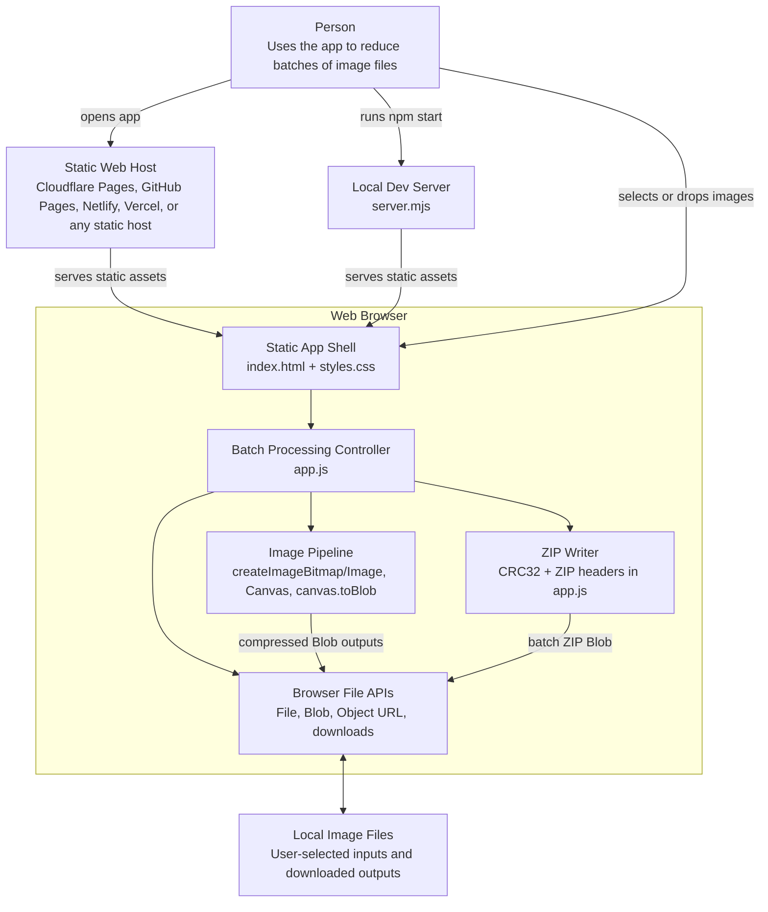

# Architecture

Bulk Image Size Reducer is a static, browser-only image compression app. Its primary architectural constraint is that selected files stay local to the user's device: the app serves HTML, CSS, JavaScript, and documentation assets, then all image processing runs in the browser.

## C4 Container Diagram

## Runtime Flow

1. The user opens the static app from a host or the local development server.
2. The browser loads `index.html`, `styles.css`, and `app.js`.
3. The user drops or selects image files. The app filters for `image/*`, creates preview object URLs, and tracks queue state in memory.
4. The user chooses output format, quality, max dimensions, suffix, and no-upscale behavior.
5. `app.js` decodes each image with `createImageBitmap`, falling back to an `Image` element when needed.
6. The app draws each image to a canvas at the target dimensions and exports a Blob with `canvas.toBlob`.
7. The user downloads individual output files or a ZIP built in memory by the app's ZIP writer.

## Deployment Shape

The production app is a static site. The local server exists only for development convenience and serves files from the project root with `no-store` caching. No production API, database, object storage bucket, worker queue, or server-side image processor is required.

## Key Constraints

- Processing large batches depends on browser memory and canvas limits.
- Browser encoders decide final compression behavior, so output can vary across browsers.
- Canvas export strips most metadata by default.
- Animated images are flattened to the first decoded frame.
